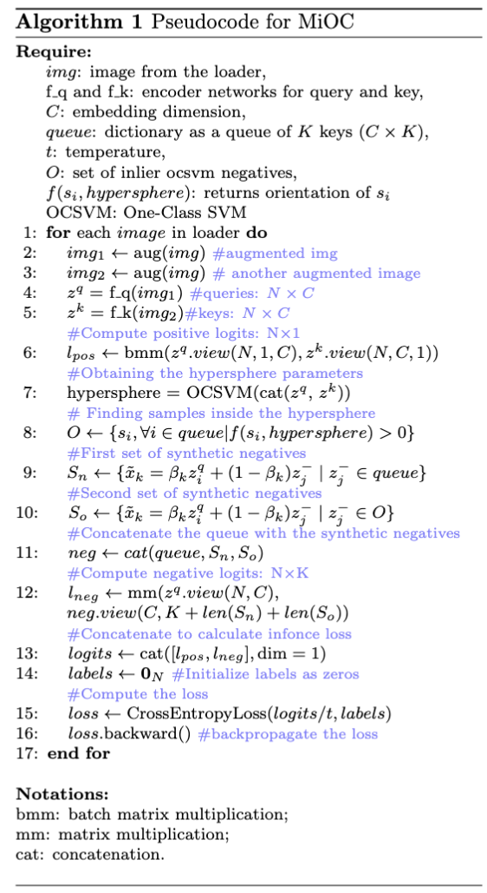

# Instructions

## Pseudocode for MiOC




## To Start the Pretraining Process

```bash
python3 lightning_main_pretraining.py
```

### To Continue the Pretraining Process 

- Change the pretraining from a checkpoint, you can change the [Checkpoint Config](conf/checkpoint_params.py) with 
```python
retrain_saved_path: [str] = "" # Path to the checkpoint to be loaded
retrain_from_checkpoint: str = "load_train" 
```

## To Start the Linear Classification Process

```bash
python3 lightning_main_lincls.py
```
- Please ensure to change the `pretrained` in the [Linear Classifier Config](conf/lincls_params.py) as the path to the trained model. 

## Modifications in Code

- We use Hydra to manage the configurations rather than argparse.
- To make changes in the hyperparameters you can change it directly in the [Pretrain Config](conf/pretrain_params.py), [Linear Classifier Config](conf/lincls_params.py), [Wandb Config](conf/wandb_params.py) and [Trainer Config](conf/trainer_params.py) files.
- We use Pytorch Lightning to manage the training process.
- This implementation with Pytorch Lightning should support ddp as well as single GPU implementation.