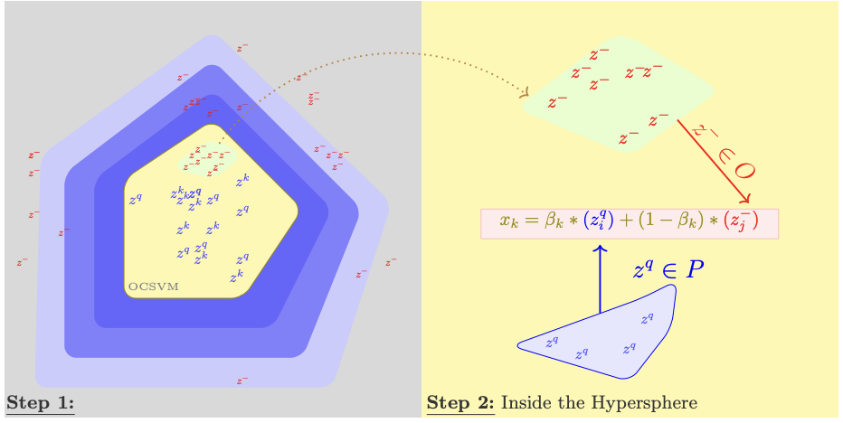
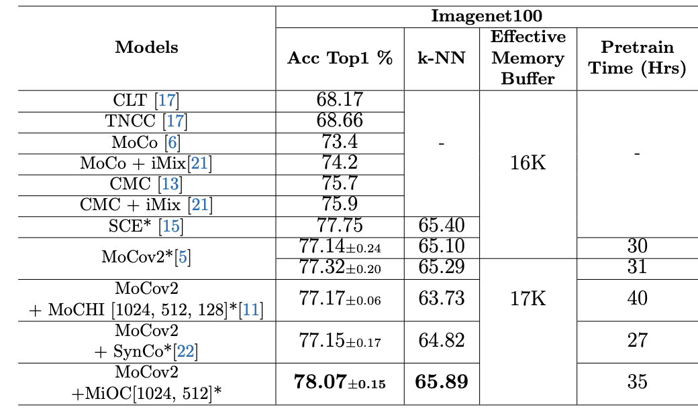
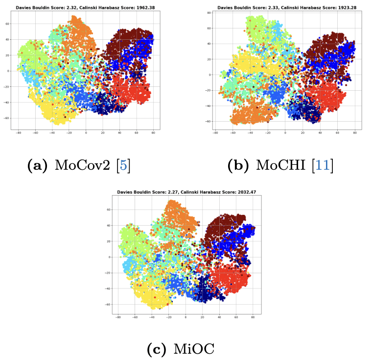

# MiOC Official Implementation


The official implementattion of the paper "One-Class SVM-guided Negative Mixing for
Enhanced Contrastive Learning". The paper is availabe at [OpenReview](https://openreview.net/forum?id=XCUzATsVdU#discussion).

* This repository is based on [MoCo Official Implementation](https://github.com/facebookresearch/moco)
## Requirements

```
pip install numpy torch blobfile tqdm pyYaml pillow jaxtyping beartype pytorch-lightning omegaconf hydra-core wandb
```

## Mixing One-Class SVM Negative Samples - MiOC

- We use One-Class SVM to find the negative samples that are most similar to the query.

- we generate $S_n$, synthetic negative samples by mixing a random query $z^q_i$ with random negative samples$z^-_i$.
- we generate the $S_o$, synthetic negative samples by mixing a random query $z^q_i$ with inner One-Class SVM negative samples$z^-_i$.



Please refer to the paper for more details.

The code is present in the [Code](Code) folder.
Please go through the [Instructions](Code/Instructions.md) for the implementation details. 

Here are the linear eval results for the Imagenet-100 dataset along with the TSNE plot of the features in Cifar-10 dataset.





## See Also
We would recommend to read the 
- [MoCo Article](https://arxiv.org/abs/1911.05722).
- [MoCHI Article](https://europe.naverlabs.com/research/publications/hard-negative-mixing-for-contrastive-learning/).

## License

This repository is released under the MIT license. 

## Contributing to MiOC

Please see this link -  [How to CONTRIBUTE](.github/CONTRIBUTING.md) for more details.

## Code of Conduct

Please see the [CODE OF CONDUCT](.github/CODE_OF_CONDUCT.md) for more details.
